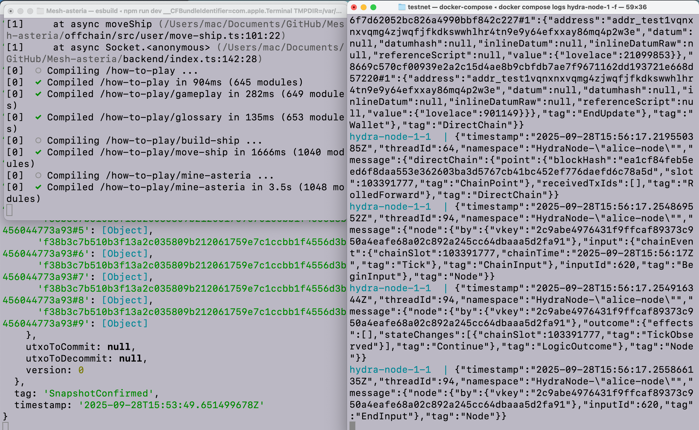
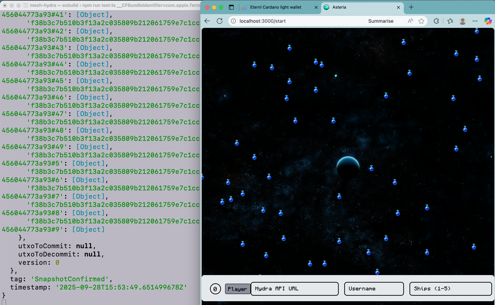
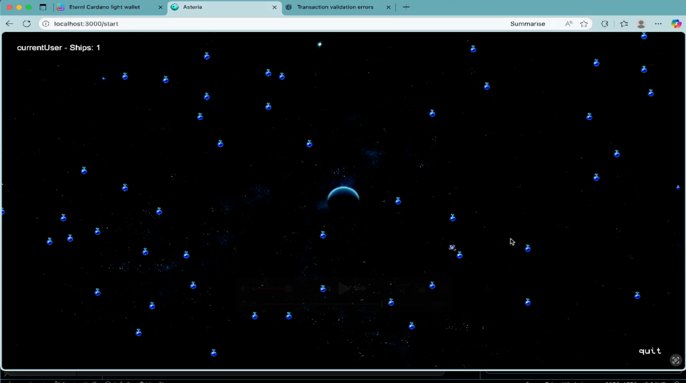

# Hydra-Asteria 🚀  

**Hydra-Asteria** is a real-time multiplayer space strategy game built on **Cardano’s Hydra Layer 2**.  
It demonstrates how the **eUTxO model** and **Hydra heads** can be used to handle **high-throughput, low-latency smart contract transactions** in a live gaming environment using MeshSDK.  

Inspired by [TxPipe’s Asteria](https://github.com/txpipe/asteria) on Cardano L1.  

---

##  Gameplay Overview  

- **Objective**  
  Navigate your ships across a **100x100 grid**, collect fuel pellets, and race to the center **(0,0)** to mine the **Asteria crystal** and win.  

  Compete against other players in real time — all moves are instantly synchronized using WebSockets.  

- **Game Loop**  
  1. Place your ship(s) on the grid  
  2. Move step by step (up, down, left, right)  
  3. Collect fuel pellets to survive  
  4. Reach the center and mine the Asteria crystal  

---


##  Technical Details  

- **Real-time Multiplayer**  
  Powered by **WebSockets** for instant synchronization.  

- **Hydra Layer 2 Integration**  
  - Hydra head operations (open, commit, close) manage fast transaction throughput.  
  - Asteria game actions (ship placement, movement, pellet collection, mining) are executed as **Hydra transactions**.  
  - Connect your **Hydra API URL** to interact with the game in Hydra.  

- **Grid System**  
  The world is a **100x100 Cartesian grid** with the center at `(0,0)`. Ships move in discrete steps.  

---

##  Prerequisites  

A running cardano and Hydra-node  

- [Mesh-hydra tutorial](https://meshjs.dev/hydra/tutorial) 

---

##  Setup & Installation  

Clone the repository:  

```bash
git clone https://github.com/MeshJS/asteria.git
cd hydra-asteria
```

```bash
yarn install
# or
npm install

NEXT_PUBLIC_HYDRA_API_URL=http://localhost:4001
```

## Head-logs Examples





